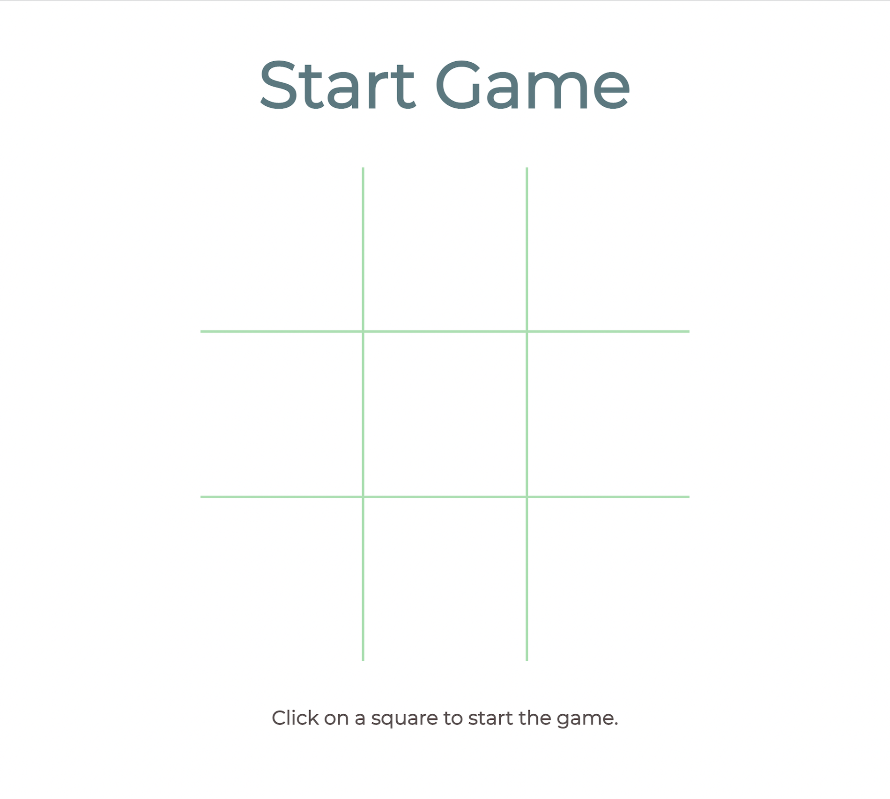

# tic-tac-toe
a game of tic tac toe.

[View Demo](https://xu-ashley.github.io/tic-tac-toe)

<!-- TABLE OF CONTENTS -->

  
Table of Contents

  <ol>
    <li>
      <a href="#about-the-project">About The Project</a>
      <ul>
        <li><a href="#built-with">Built With</a></li>
      </ul>
    </li>
    <li><a href="#contact">Contact</a></li>
    <li><a href="#acknowledgments">Acknowledgments</a></li>
  </ol>

<!-- ABOUT THE PROJECT -->
## About The Project

(<a href="#top">back to top</a>)

### Built With

* HTML/CSS
* [Javascript](https://www.javascript.com/)
* [JQuery](https://jquery.com)

(<a href="#top">back to top</a>)

<!-- CONTACT -->
## Contact

Ashley Xu

Project Link: [https://github.com/xu-ashley/tic-tac-toe](https://github.com/xu-ashley/tic-tac-toe)

(<a href="#top">back to top</a>)

<!-- ACKNOWLEDGMENTS -->
## Acknowledgments

* 

(<a href="#top">back to top</a>)

